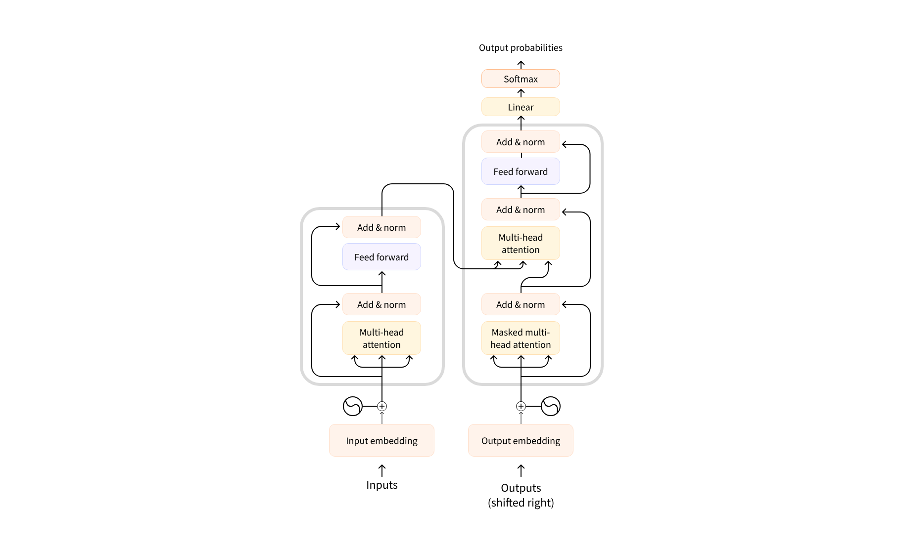

# Como os Transformer Trabalham

Começemos com um pouco de história, existe um artigo muito famoso, "Atenção é tudo o que você precisa", ele foi laçado em Junho de 2017, nessa epóca o foco da arquitetura Transformer era a tradução. Com o tempo, alguns moelos foram se destacando:

* **Julho de 2018** GPT é o primeiro modelo Transformer pré-treinado.
* **Outubro de 2018** BERT seu objetivo era produzir resumo de senteças.
* **Fevereiro de 2019** GPT-2 uma versão do GPT que não chegou a ser lançada.
* **Outubro de 2019** DistilBERT ou BERT-2.
* **Outubro de 2019** BART e T5 modelos treinados usando a arquitetura original dos transformers
* **Maio de 2020** GPT-3 Modelo maior do que o anterior e agora capaz de performar em tarefas sem a necessidade de ajuste-fino.

Por obvio a lista não para por aí, ela vai *ad infinitum*. Porém, podemos classificar todos os modelos da seguite forma:

* **GPT-like** Modelos Transformers *auto-regressivos*
* **BERT-like** Modelos Transformers *auto-codificadores*
* **BART/T5-like** Modelos Transformers *sequence-to-sequence*

## Transformer são modelos de linguagem

Eles são treinados em grande quantidades de texto de forma auto-supervisionada, eliminando assim a rotulação de dados por parte dos humanos.

Com esse tipo de treinamento ele consegue compreender a linguagem, mas não consegue resolver tarefas especifias. Por isso eles passam por um processo de *aprendizagem de transferência*, nesse processo a ajuste do modelo é feito de maneira supervisionada, agora o humano volta ao role.

Como exemplo de tarefa temos a previsão duma próxima palavra dados um sequência de palavras, isso é a *modelagem de linguagem casual*. Nesse caso não estamos olhando as palavras futuras.

Já a *modelagem de linguagem mascarada* leva enconta as palavras passadas e futuras para prever uma palavra mascarada no meio da frase.

## Transformers são modelos grandes

A estratégia adotada foi aumentar o número de parametros do modelos, e para isso precisou-se duma quantidade ENORME de textos. Isso eleva o custo e tempo para criar os modelos.

Mas nem tudo são expinhos, é possível pegar um modelo já treinado e contruir modelos em cima desses pesos, isso reduz os custo envolvidos.

## Transferência de Aprendizagem

*Pré-treinamento* é começar tudo do zero, "chuta" os pesos iniciais, passa uma grande quantidade de dados pelo modelos e pronto.

**Base Model** -> *Very Large Corpus* -> ***$$$ in compute*** -> Days Of Training -> **Pretrained Language Model**

O tempo de treinamento pode ser semanas, o custo o "peso do leitor em ouro".

Aos pobres *Ajuste Fino*, pega um modelo pré-treinado, e adiciona a ele os dados especificos da tarefa que deseja. Sem contar que ele ajuda a obter melhores resultados, salvo quando dados não são o problema, é só escolher um  modelo perto da tarefa que deseja realizar e treina-lo com dados do dominio.

## Arquitetura geral

Essa arquitetura pode ser usada d'algumas formas. Imagine que cada bloco grande desses damos o nome de Encoder e Decoder, o primeiro é o menor deles. Eles podem ser usados juntos ou separados.

O Encoder aceita entrada que representam texto, as converte em representação digital, que podem ser chamadas de Embeddings ou Features. Esse modelo é otimizado para adquirir entendimento da entrada.

O Decoder é semelhante, ele se difere por ter uma propriedade unidirecional que é usada de maneira autorregrassiva. E esse modelo é otimizado para gerar saída.

Adivinha o que temos combinando os dois? Encoder-Decoder, ou melhor, transformador sequenci-to-sequenci. O Encoder funciona igual, recebe um texto e transforma em representação digital, essas serão as entradas do Decoder, bem como outras coisinhas, tudo isso para tentar prever a saída, essa que será usada no futuro, daí o nome "auto-regressivo".

Dessa forma, podemos dizer que cada um se dará bem em seu jogo.

* Modelo somente de Encoder: Usado para classificação de sentença e reconhecimento de entidade nomeada.
* Modelo somente de Decoder: Bom para ser usado na geração de texto.
* Encoder-Decoder: Bom para ser usado em geração de texto que depende duma entrada, por exemplo tradução.

## Comada de Atenção

Essa é a camada que da nome ao artigo original, é ela que diz ao modelo quais são as palavra relevantes na frase, e meio que deixar as outras de lado. Para associar a linguagem, uma palavra não quer dizer nada, o contexto em que ela foi escrita sim, e isso é atenção, o que o modelo deve olhar além da palavra que está analisando para chegar a uma conclusão sobre seu significado.

## Arquitetura Original

A principio era para o modela trabalhar com tradução. O Encoder recebe as mensagem que serão traduzidas, o Decoder as mesmas mensagem na lingua destino. As camadas de atenção do Encoder podem usar todas as palavras. Já o decodificador trabalha sequêncialmente, e só presta atenção nas palavras que já foram traduzidas.

Para deixar o treinamento um pouco mais otimizado, é possível alimentar o Decoder com todas as palavras alvo, mas ele não pode usar palavras futuras.

Ao olhar o esquema das camadas, observamos que o Decodificador recebe suas entradas e as passa por uma camada de atenção, depois essas entradas são juntadas com aquelas que vieram do Encoder e passam novamente por uma camada de atenção.

As frases podem conter palavras que não devem ser usadas, com isso conseguinos fazer com que o modelo não preste atenção nelas.

## Arquiteturas vs. Checkpoints

Dando nome às coisas:

* Arquitetura: Definição de cada camada e cada operação que acontece.
* Checkpoints: Pesos duma dada arquitetura.
* Modelos: Pode representar os dois anteriores.

Por exemplo bert-base-cased é a arquitetura, os pesos gerados pelo treinamento são os checkpoints, e tudo pode se resumir em Modelo, só usar a sua camada de atenção.